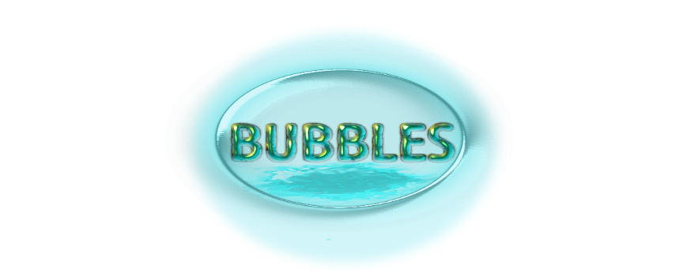

Virtual Reality environments with Node.js and Three.js.

### Info (30/12/2014)
We're working in our backend for the **v0.1.0**.
At the beginning, I was learning from node.js and the way it works, so I did my own little modules that made one thing at a time, and implemented it in the backend. Now, I want to contribute to Node.js and its developers, so I chose "_Express.js_" for this project. I don't wanna build stuff that are already made, by other hand, I'd like to contribute by using those modules, made by the really pros. We have a lot to learn :)
> By Rodrigo González López (@SametSisartenep)

### Thanks to

- _@mrdoob (Ricardo Cabello)_ for providing us the [**Three.js**](http://threejs.org) library.
- _@ry (Ryan Dahl)_, _@isaacs (Isaac Z. Schlueter)_ and _Joyent_ for their event-driven, non-blocking [**Node.js**](http://nodejs.org) platform.
- _@jeresig (John Resig)_ for his [**jQuery**](http://jquery.com) API.
- _Everyone_ at [**npm**](http://npmjs.org) who is writing those amazing modules! :)

### LICENSE

[BSD Clause 3](LICENSE) copyright (c) 2014, [Bubbles' Team](CONTRIBUTORS.md)
